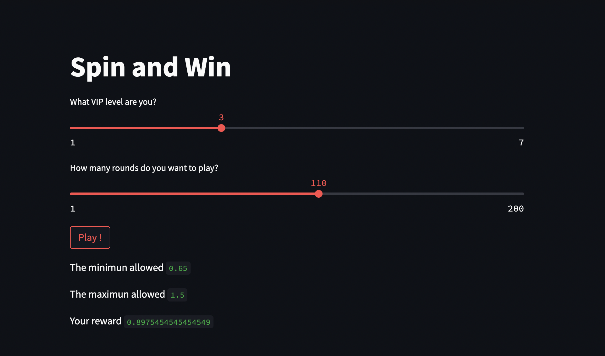

# Welcome to SpinNwin!


### We used streamlit in order to get a user friendly interface with the game

## Files
- config.yml : the rewards rules
- level-config.yml : the vipe level rules
- game.py : game logic
- round.py : round logic
- main.py : standard python main file interface with the game
- app.py : streamlit interface with the game (more user friendly ;))

## Steps to run the game with streamlit

```yaml
# Install python packages
pip install -r requirements.txt

# Run the streamlit app
streamlit run app.py
```

## Feel free to play


